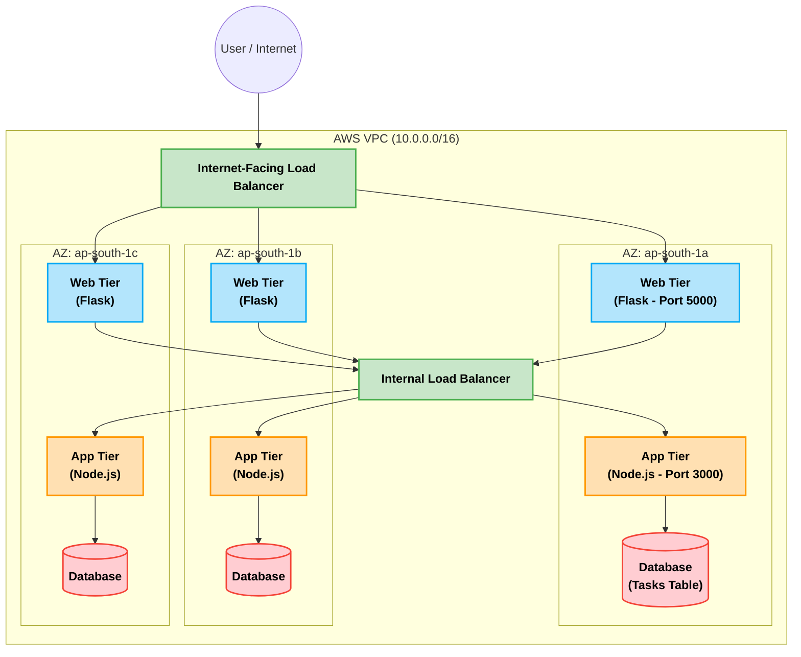
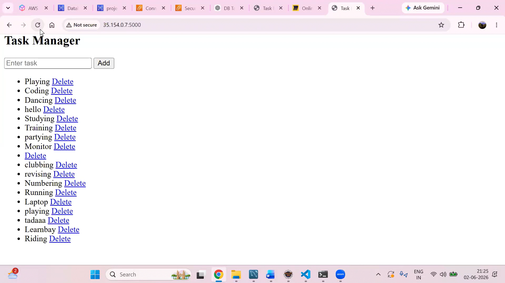
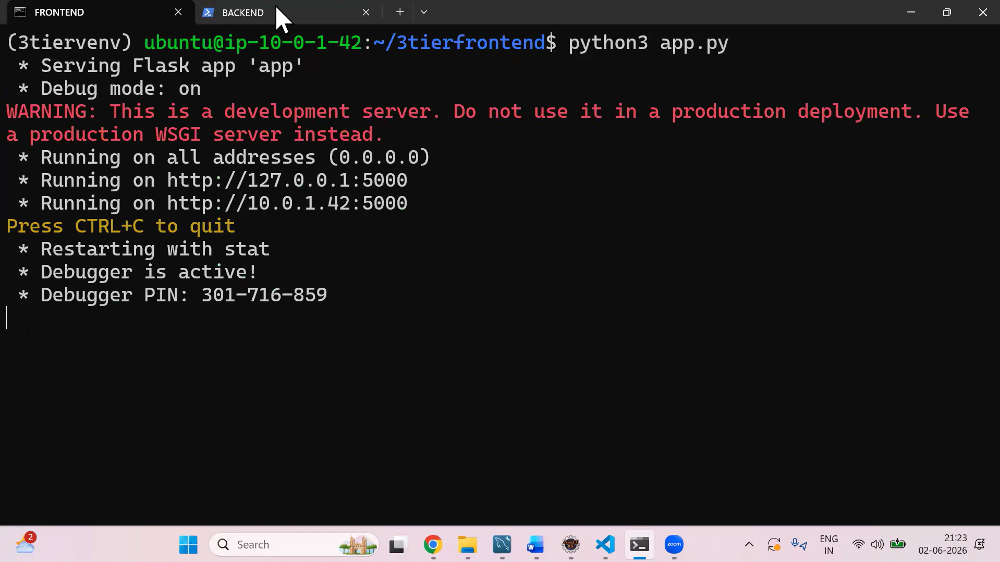
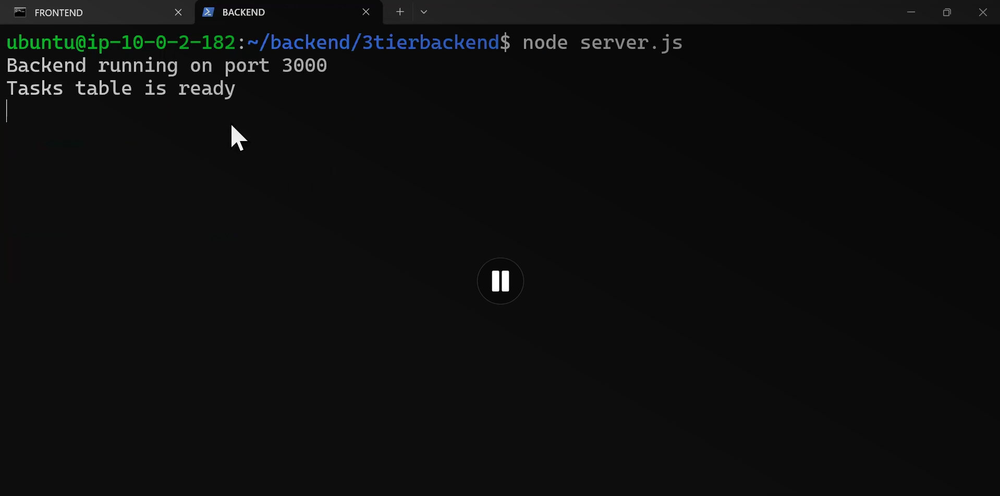

# 3-Tier Task Manager Application

This repository contains a highly available, fault-tolerant 3-tier web application deployed on AWS (`ap-south-1`).

## System Architecture

Infrastructure Configuration Details
Frontend Tier: Deployed on Ubuntu EC2 instances running a Flask web server on Port 5000.
Backend Tier: Deployed on isolated private subnets on Ubuntu EC2 instances running a Node.js Express server on Port 3000.
Database Connection: Connects locally to your database instance to safely manage and expose the Tasks table to the frontend via API endpoints
## Application Preview & Deployment Screenshots

To verify the successful end-to-end deployment of this highly available 3-tier architecture, see the execution states of our environments below:

### 1. Live Task Manager User Interface
The web application interface running live via the AWS Application Load Balancer, fully capable of adding, viewing, and clearing tasks.

### 2. Frontend Web Server (Flask)
The Flask server executing successfully within its virtual environment (`3tiervenv`) on the Ubuntu EC2 instance, listening on port 5000.

### 3. Backend API Gateway (Node.js)
The Node.js backend actively running on port 3000 inside its decoupled environment, confirming that the structural database tasks table is ready to accept queries.

